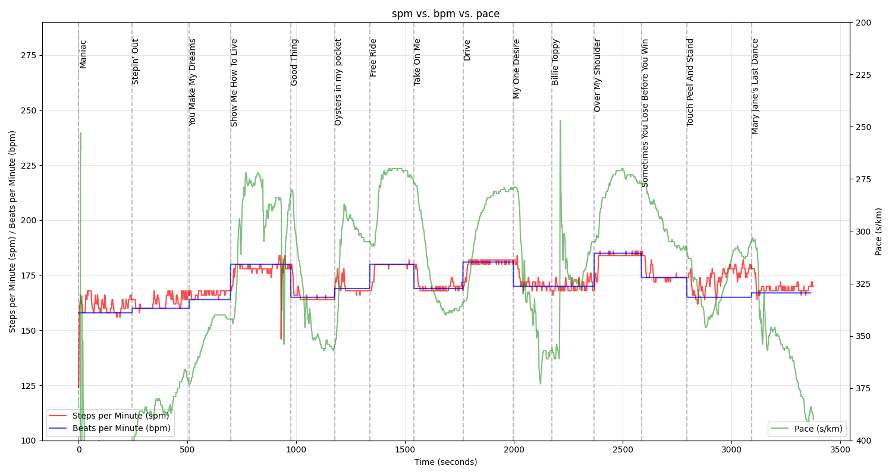

# run-the-beat

I like to listen to music when I run, preferably music that I can run to the beat of. I have a [list of songs](https://open.spotify.com/playlist/22uoD3ZLirQJEVJL8uStxx?si=1cyltRdcSZ2bQD9bNALCTg) that are suitable for this purpose. I wrote down the “beats per minute” for each song and created [another one lasting about an hour](https://open.spotify.com/playlist/0rHEeJw3PP6kU8KRSOpufZ?si=rYXNoxWUSRS7njo4AzVdZg) (including 10 mins warm-up, 5 mins cool down). Because the songs vary in length, this is not really suitable for fixed intervals, but it is for a fartlek. 

The graph shows how precisely I adhered to the training target. Obviously I didn't cope so well with the slow bpm or the songs are not so suitable for running to the beat. But around 180 bpm it actually went quite well.

You can find the playlist, the running data and the script here. I got the running data from my [Runalyze](https://runalyze.com/) account.
